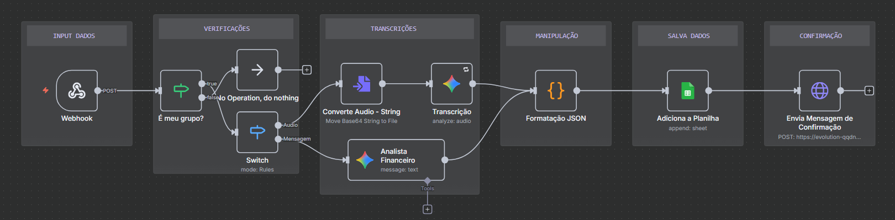

# Controle Financeiro com LLM e n8n

## Visão geral
Este repositório documenta um projeto pessoal que integra WhatsApp → n8n → LLM → Google Sheets → Power BI. O objetivo é permitir o registro rápido de gastos pessoais falando no WhatsApp: o áudio é transcrito e convertido para JSON (data, categoria, valor, descrição, pessoa, método de pagamento), salvo em uma planilha e exibido em dashboards para o melhor acompanhamento.

**Fluxo (resumido):**

* WhatsApp (Webhook) → n8n (orquestração) → Conversão Áudio→ Texto → LLM (estrutura JSON) → Google Sheets (append) → Power BI (visualização)




---

## 🗂️ Estrutura do repositório

```
whatsapp-financial-tracker/
├─ docs/                    # prints, diagramas e material visual
├─ workflows/               # export do workflow do n8n (.json)
├─ prompts/                 # prompts e exemplos de instruções para o LLM
├─ README.md                

```

---

## 🧩 Componentes principais

* **n8n** — Orquestração do fluxo (Webhook, switches, conversão de base64, chamadas HTTP para LLM, formatação e append ao Sheets).
* **WhatsApp API / Provider** — Ponto de entrada dos áudios (via webhook para n8n).
* **LLM (ex: OpenAI / outro)** — Transforma texto/transcrição em JSON estruturado.
* **Google Sheets API** — Persistência simples para histórico de gastos.
* **Power BI** — Dashboard para análise de gastos agregados (categoria, por período, médias, alertas).

---

## 🛠️ Como reproduzir localmente / Deploy

> Abaixo há passos gerais — adapte conforme seu provedor de WhatsApp, chave do LLM e infraestrutura.

### 1) Pré-requisitos

* Conta e acesso à API do WhatsApp (ou provedor compatível)
* n8n (local via Docker, n8n.cloud ou servidor)
* Chave de API do LLM (ex.: OpenAI)
* Conta Google com acesso à Sheets API e credenciais
* Power BI Desktop (para criar o dashboard) ou Power BI Service

### 2) Variáveis de ambiente (exemplo `.env`)

```
WHATSAPP_WEBHOOK_SECRET=xxxx
LLM_API_KEY=sk-xxxx
GOOGLE_CREDENTIALS_JSON=path/to/credentials.json
SHEETS_SPREADSHEET_ID=1aBcDeFG...
N8N_HOST=http://localhost:5678
```

> Coloque um `.env.example` no repositório com os nomes das variáveis (sem valores reais).

### 3) Importar o workflow no n8n

1. No n8n, clique em **Import** → escolha o arquivo `workflows/whatsapp_workflow.json` (export do seu workflow).
2. Ajuste as credenciais (WhatsApp webhook, LLM, Google Sheets) dentro do editor do n8n.
3. Ative o workflow.

### 4) Teste do fluxo

* Envie um áudio pelo WhatsApp para o número configurado.
* Verifique logs no n8n: conversão base64 → transcrição → chamada LLM → formatação JSON → append no Sheets.
* Abra a planilha no Google Sheets e confirme a linha adicionada.

---

## 🔧 Descrição dos nós do workflow (baseado no print enviado)

1. **Webhook (INPUT DADOS)**

   * Recebe POST do provedor do WhatsApp.
   * Dispara o fluxo no n8n.

2. **Verificações (É meu grupo? / Switch)**

   * Filtra mensagens que não são do grupo/conta desejada.
   * Se não for válido → operation do nothing.

3. **Transcrições**

   * **Converte Audio - String**: move base64 string para arquivo (para transcrição se necessário).
   * **Transcrição**: nó que executa a transcrição (pode ser um serviço externo ou LLM que aceite áudio).
   * **Analista Financeiro (LLM)**: recebe texto e executa prompt para estruturar em JSON com campos padrão.

4. **Manipulação (Formatação JSON)**

   * Normaliza campos (converte valor para float, formata data, categorização básica).

5. **Salva Dados (Adiciona a Planilha)**

   * Nó Google Sheets: append row com o JSON transformado.

6. **Confirmação (Envia Mensagem de Confirmação)**

   * Post de retorno ao usuário confirmando que a despesa foi registrada com sucesso.

---

## 📋 Exemplo de prompt (arquivo em `prompts/llm_analista_financeiro.md`)

```text
Você é um analista financeiro. Recebe uma transcrição de áudio com a seguinte mensagem:

"Ontem gastei 37.50 no almoço, categoria alimentação, 2025-11-11, almoço com cliente"

Retorne apenas um JSON com as chaves: data (YYYY-MM-DD), categoria, valor (float), descricao.
Se algum campo não for informado, deixe como null.
```

**Exemplo de saída esperada:**

```json
{
  "data": "2025-11-11",
  "categoria": "Alimentação",
  "valor": 37.5,
  "descricao": "Almoço com cliente"
}
```

---

## ✅ Boas práticas e recomendações

* **Validação de entradas**: Sempre valide formato de data e tipo numérico do valor antes de salvar.
* **Tratamento de ruído na transcrição**: Tenha regras fallback (ex: regex para extrair números) caso a LLM não retorne corretamente.
* **Segurança & privacidade**: Áudios e transcrições são dados sensíveis — remova logs com dados pessoais antes de publicar e use credenciais seguras.
* **Rate limits**: Garanta retry/backoff para chamadas ao LLM e API do WhatsApp.
* **Testes unitários**: Mantenha scripts em `scripts/` para validar prompts e transformações JSON.

---

## 📈 Power BI — sugestões de métricas

* Despesa total por mês
* Despesa média por dia
* Top 5 categorias (por valor)
* Despesa por dia da semana
* Alertas: gasto acima do orçamento mensal

---

## 🎯 Roadmap / Próximos passos

* Categorização automática por taxa de confiança do LLM
* Treinar/ajustar prompt com few-shot examples para melhorar precisão
* Adicionar integração com um banco de dados SQL para histórico (se necessário)
* Notificações proativas (ex: quando exceder X no mês)

---

## ⚠️ Observações legais / privacidade

Este projeto lida com dados de consumo pessoal (áudio e transcrições). Se for publicar o repositório com exemplos reais, **anonimize** as amostras de áudio e as linhas na planilha. Nunca commit credenciais (tokens/API keys).

---

## ✍️ Autor

**Felipe Duarte** — Analista / Cientista de Dados

Contato: adiciona teu LinkedIn no README final antes de publicar.

---

Se quiser, eu já gero:

* 1. o `README.md` pronto para o repo (com o conteúdo acima),
* 2. um `workflows/whatsapp_workflow.json` de exemplo (esqueleto) pronto pra importar no n8n, ou
* 3. adapto o README para inglês para colocar no GitHub público.

Diz o que prefere que eu gere agora.
